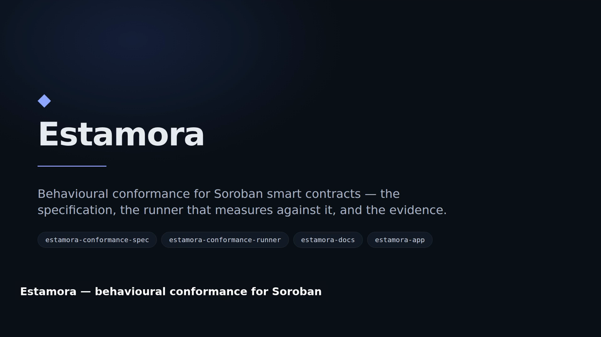
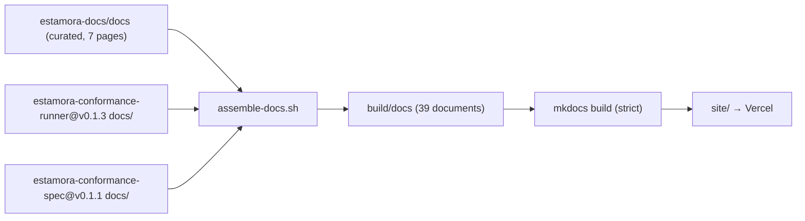

# estamora-docs

**The documentation site for [Estamora](https://github.com/Estamora-Soroban-Layers): what
behavioural conformance is for, how to measure a Soroban contract, and how to tell what a
verdict means.**

[](https://github.com/Estamora-Soroban-Layers/estamora-docs/actions/workflows/ci.yml)
[](https://estamora-docs.vercel.app)
[](https://estamora-docs.vercel.app/assets/estamora-pitch.mp4)
[](LICENSE)

**Read it: <https://estamora-docs.vercel.app>**

---

## Watch the pitch

<a href="https://estamora-docs.vercel.app/assets/estamora-pitch.mp4">
  
</a>

**[Five minutes, 1920×1080, no sign-in.](https://estamora-docs.vercel.app/assets/estamora-pitch.mp4)**
Every frame is a live deployment or output a program actually produced — the captured terminal
transcripts come from the release binary, and the application screenshots come from the
deployed site. The pipeline that builds it is committed in [`video/`](video/), so the video can
be regenerated rather than decaying into an artefact nobody can correct.

The link above points at the published site, which serves the file as `video/mp4` with byte
ranges so the browser plays it in place. It deliberately does **not** point at the release
asset: GitHub serves those as `application/octet-stream` with
`content-disposition: attachment`, so the same bytes become a 15 MB download instead of a
video. The [immutable release copy](https://github.com/Estamora-Soroban-Layers/estamora-docs/releases/download/pitch-v1/estamora-pitch.mp4)
is there as an archival download.

## What this repository is, and what it deliberately is not

It is the reader's documentation: installation, a first measurement, CI integration, and the
reference for the command line, exit codes, error classes and report format.

It is **not** a second copy of the specification. The normative documents — the profiles, the
JSON Schemas and the test vectors — have a canonical home at
<https://estamora-soroban-layers.github.io/estamora-conformance-spec/>, which is where every
schema `$id` resolves.

Copying them here would mean a normative document existing in two places that can disagree.
That is the specific class of defect the specification repository already spends a validation
job preventing *between its own profiles and schemas*; introducing it between a document and
its published rendering would be a regression, in a project whose entire claim is that it is
careful about drift.

## How the site is assembled

Nothing is copied into this repository. The site is **assembled at build time** from pinned
revisions of the two source repositories:

| Section | Source | Pin |
| --- | --- | --- |
| Home, Getting started, Concepts, Reference | this repository, `docs/` | — |
| Runner guide | `estamora-conformance-runner` → `docs/*.md` | `v0.1.3` |
| Specification | `estamora-conformance-spec` → `docs/**` | `v0.1.1` |



Two consequences that make this worth the assembly step:

1. **A page on the site traces to a commit in the repository that owns it.** The pin is a
   tag, not a branch, so a published page cannot change under its URL without a commit here.
2. **The navigation enumerates every page.** Because the page set is fixed by the tags, a
   document cannot appear on the published site without a commit here that names it.

The documents' relative links (`](../schema/…)`, `](../VERSIONING.md)`) are rewritten during
assembly to the absolute URL that actually serves them. That is deliberate: rewriting keeps
`strict: true` link validation meaningful. With those links broken on purpose, MkDocs would
have to be told to ignore broken links — and it would then also ignore a genuine one.

## Building it

Requires Python 3.12 or later.

```bash
python3 -m venv .venv && . .venv/bin/activate
pip install -r requirements-docs.txt

./scripts/build-site.sh              # assemble + render into ./site
./scripts/build-site.sh /tmp/out     # somewhere else
```

One entry point for CI and for a contributor, because the two must not build different sites.
It asserts the assembled document count and the rendered page count, so a site that builds
successfully while missing its content fails instead of publishing.

To build against local checkouts instead of the pinned tags — the usual case while working on
a sibling repository:

```bash
ESTAMORA_RUNNER_REPO=../estamora-conformance-runner \
ESTAMORA_SPEC_REPO=../estamora-conformance-spec \
  ./scripts/build-site.sh
```

With neither set, the script uses a sibling checkout when one exists and otherwise clones the
pinned tag into `.vendor/`.

## Deploying it

Deployment is CI-driven. `.github/workflows/deploy-vercel.yml` builds the site and publishes
the built artefact to Vercel on every push to `main`, so what is deployed is what CI built and
validated — not a second build on a different machine.

Vercel does not build this site. Its build step is `scripts/assert-built.sh`, which asserts
the artefact exists rather than producing it. Publishing nothing is worse than publishing
nothing *updated*, because the site is where the documentation is read.

| | |
| --- | --- |
| Production | <https://estamora-docs.vercel.app> |
| Project | `estamora-docs` (team `winningtalker-commits`) |

## Checks

| Workflow | What it enforces |
| --- | --- |
| `ci.yml` → build | The site assembles and renders with `strict: true`, and contains the pages it should. |
| `ci.yml` → pins | The pinned revisions still resolve upstream, and reports when a newer tag exists. |
| `ci.yml` → links | Every external URL in the curated documentation resolves. |
| `deploy-vercel.yml` | A push to `main` publishes the artefact CI built. |

## Contributing

See [`CONTRIBUTING.md`](CONTRIBUTING.md). A documentation change that contradicts a pinned
document is a change to the *pin*, or a change in the repository that owns the document —
never a quiet edit here.

## Security

See [`SECURITY.md`](SECURITY.md).

## License

Apache-2.0. See [`LICENSE`](LICENSE).
