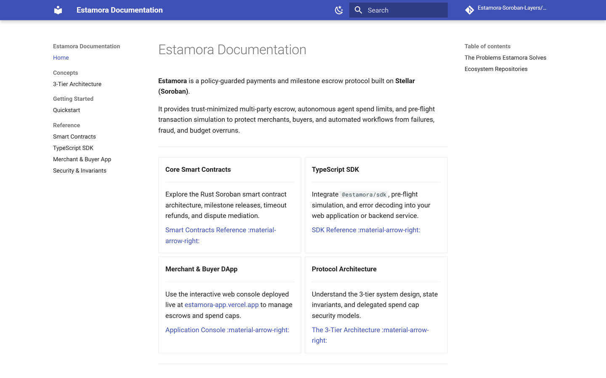

# Estamora Documentation Hub

[](https://estamora-docs.vercel.app)
[](https://github.com/Estamora-Soroban-Layers/estamora-docs/actions/workflows/ci.yml)
[](LICENSE)

> **Architectural blueprints, smart contract specifications, TypeScript SDK guides, and developer tutorials for the Estamora Payment Protocol on Stellar (Soroban).**

**Live Documentation Portal**: **[https://estamora-docs.vercel.app](https://estamora-docs.vercel.app)**  
**Live DApp Console**: **[https://estamora-app.vercel.app](https://estamora-app.vercel.app)**

---

## Documentation In Action

The Estamora Documentation Hub serves as the primary technical resource for integrators, auditors, and ecosystem builders.

### Interactive Technical Documentation Portal
Features full-text search, responsive multi-device navigation, code syntax highlighting, and detailed API references.



### Integrated DApp & Escrow Lifecycle Guides
Step-by-step visual guides walking developers through escrow creation, milestone progression, and dispute mediation.


---

## The Estamora Protocol Architecture

The Estamora Protocol provides an integrated three-tier stack:

| Layer | Repository | Primary Responsibility | Technology |
| :--- | :--- | :--- | :--- |
| **Tier 1: Smart Contracts** | [**`estamora-contracts`**](https://github.com/Estamora-Soroban-Layers/estamora-contracts) | On-chain milestone escrow, dispute split logic, and delegated spend-cap engine | Rust, Soroban SDK v22 |
| **Tier 2: Client SDK** | [**`estamora-sdk`**](https://github.com/Estamora-Soroban-Layers/estamora-sdk) | Pre-flight RPC simulation, fee estimation, and TypeScript client bindings | TypeScript, `@stellar/stellar-sdk` |
| **Tier 3: Web DApp** | [**`estamora-app`**](https://github.com/Estamora-Soroban-Layers/estamora-app) | Non-custodial merchant dashboard, checkout demo, and Freighter operator console | React 19, Vite, `@stellar/freighter-api` |
| **Documentation Hub** | [**`estamora-docs`**](https://github.com/Estamora-Soroban-Layers/estamora-docs) | Complete protocol specifications, guides, and developer documentation | MkDocs Material, Markdown |

---

## Key Protocols & Primitives Documented

1. **Milestone Escrow State Machine**: Dual-party programmable custody where buyer funds remain locked in the contract until the seller satisfies deliverables, with an automated fallback refund if the timeout expires.
2. **Autonomous Agent Spend Caps**: On-chain guardrails allowing secondary accounts (AI agents, microservices) to spend funds up to a strict per-transaction and rolling 24-hour ceiling.
3. **Pre-Flight Simulation Engine**: Zero-gas evaluation querying Soroban Testnet RPC to calculate exact CPU instructions and stroop resource fees prior to wallet signing.
4. **Ledger Storage Management (`extend_ttl`)**: Handling Soroban storage expiration and TTL extensions to guarantee state persistence.

---

## Local Development & Documentation Build

### Prerequisites
- Python 3.10+
- `pip` package manager

### 1. Install Dependencies
```bash
pip install -r requirements.txt
```

### 2. Run Local Documentation Server
```bash
mkdocs serve
```
Open [http://localhost:8000](http://localhost:8000) to view documentation changes in real time.

### 3. Build Static HTML Bundle
```bash
mkdocs build --strict
```
Strict mode ensures all cross-references, images, and links resolve with zero broken paths.

---

## Community & Ecosystem Links

- 💬 **Telegram**: [Estamora Community](https://t.me/estamora_stellar)
- 👾 **Discord**: [Estamora Developers](https://discord.gg/estamora-dev)
- 👤 **Maintainer**: [@winningtalker-commits](https://github.com/winningtalker-commits)
- 🌐 **Testnet Contract**: `CADQOBYHA4DQOBYHA4DQOBYHA4DQOBYHA4DQP5KR`

---

## License

Licensed under the Apache License, Version 2.0. See [LICENSE](LICENSE) for details.
