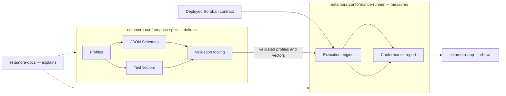

# The layers, and who owns what

Estamora is four repositories, and the boundaries between them are the design. Each boundary
exists because crossing it would make a claim unfalsifiable.

## The specification: defines

[`estamora-conformance-spec`](https://github.com/Estamora-Soroban-Layers/estamora-conformance-spec)
holds the normative layer: ten JSON Schemas in draft 2020-12, released profile bundles, the
shared vector library, and the validation tooling that keeps them self-consistent.

**It never claims a contract conforms.** It defines requirements. It has no execution engine
and does not know how to reach an RPC endpoint.

## The runner: measures

[`estamora-conformance-runner`](https://github.com/Estamora-Soroban-Layers/estamora-conformance-runner)
executes a profile's vectors against a contract and produces the report. Its report is the
only artefact that carries a conformance claim.

**It is replaceable.** Nothing in the specification format depends on it. A second
implementation in another language is a supported outcome rather than a rewrite, which is why
the specification is a data format and not a library.

## These docs: explains

This site is the reader's documentation. It is assembled at build time from the exact
revisions of the two repositories above, so a page here traces to a commit there.

**It is not a second copy of the specification.** A normative document existing in two places
that can disagree is the specific defect the specification repository's own validation exists
to prevent, and reproducing the normative documents here would introduce it. The canonical
home of the schemas and profiles remains the
[specification site](https://estamora-soroban-layers.github.io/estamora-conformance-spec/),
which is where every schema `$id` resolves.

## The application: shows

[`estamora-app`](https://github.com/Estamora-Soroban-Layers/estamora-app) presents conformance
evidence for live testnet contracts. It **reads** results. It cannot produce a verdict, and it
must not appear to: a verdict is produced by the runner, against a named profile revision,
over a named corpus.

## The rule that keeps the boundaries honest

| If you want to… | Change this | Not this |
| --- | --- | --- |
| Require different behaviour | a profile in **spec** | the runner |
| Measure a different language | add a **runner**, not a spec change | the specification |
| Explain the model | **estamora-docs** | inline prose in a schema |
| Display a result | **estamora-app** | the report format |

And one that is not negotiable: **a change that alters what a profile requires is a version
change, never an edit** — including changes that look small. See
[Versioning](https://estamora-soroban-layers.github.io/estamora-conformance-spec/versioning/).

## What none of the layers do

Conformance is not security. Passing a profile means a contract behaved as that profile
defines, and profiles are written by people. A profile that does not state a failure mode does
not detect it. Nothing in Estamora replaces formal verification, a security audit, penetration
testing or economic analysis, and a conformant contract can still be exploitable.
