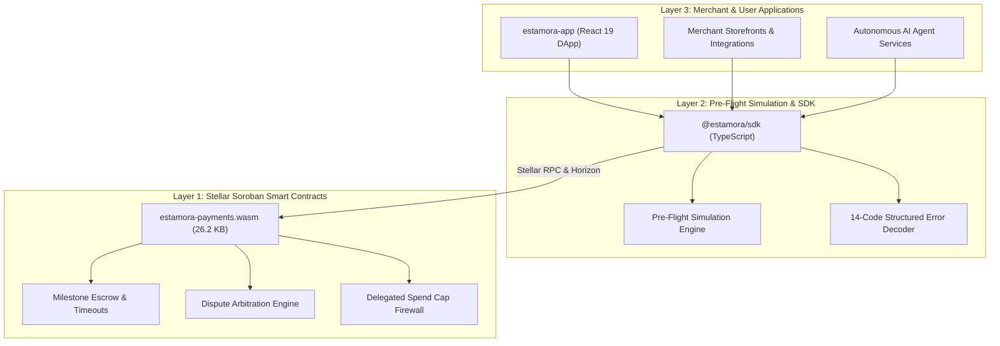

# The 3-Tier Architecture

Estamora is structured across three cohesive, decoupled layers designed to provide end-to-end payment security on Stellar:

```mermaid
flowchart TD
    subgraph L3["Layer 3: Merchant & User Applications"]
        APP["estamora-app (React 19 DApp)"]
        MERCHANT["Merchant Storefronts & Integrations"]
        AGENT["Autonomous AI Agent Services"]
    end

    subgraph L2["Layer 2: Pre-Flight Simulation & SDK"]
        SDK["@estamora/sdk (TypeScript)"]
        SIM["Pre-Flight Simulation Engine"]
        ERR["14-Code Structured Error Decoder"]
        SDK --> SIM
        SDK --> ERR
    end

    subgraph L1["Layer 1: Stellar Soroban Smart Contracts"]
        CONTRACT["estamora-payments.wasm (26.2 KB)"]
        ESCROW["Milestone Escrow & Timeouts"]
        ARBITRATION["Dispute Arbitration Engine"]
        FIREWALL["Delegated Spend Cap Firewall"]
        CONTRACT --> ESCROW
        CONTRACT --> ARBITRATION
        CONTRACT --> FIREWALL
    end

    APP --> SDK
    MERCHANT --> SDK
    AGENT --> SDK
    SDK -->|Stellar RPC & Horizon| CONTRACT
```

---

## 1. On-Chain Smart Contracts (`estamora-contracts`)

The foundational settlement and policy enforcement layer:
- **Language & Runtime**: Rust compiled to `wasm32v1-none` (Soroban SDK v22.0.8).
- **Core Functions**:
  - `create_escrow`: Locks funds in contract temporary/instance storage with defined beneficiaries, milestones, and timeout block numbers.
  - `release_milestone`: Releases percentage or fixed allocations to merchant.
  - `refund_escrow`: Allows payer to claim 100% refund once the timeout block passes without milestone fulfillment.
  - `open_dispute` & `resolve_dispute`: Locks escrow state and lets designated arbitrator apportion funds between payer and merchant.
  - `set_spend_cap` & `execute_delegated_payment`: Implements 24-hour rolling window limits and per-transaction caps for delegated agent spenders.

---

## 2. Pre-Flight Simulation SDK (`estamora-sdk`)

The safety and developer integration layer:
- **Language**: TypeScript (`@estamora/sdk`), distributed as ESM and CommonJS.
- **Client Features**:
  - Pre-flight transaction simulation before wallet prompt, preventing failed network fees.
  - Error decoding mapping low-level contract error codes (1–14) to actionable human messages.
  - Strict type definitions for escrow parameters, milestones, and spend policies.

---

## 3. Merchant & Buyer Console (`estamora-app`)

The user-facing management interface:
- **Stack**: React 19, TypeScript, Vite, Tailwind CSS / modern CSS tokens.
- **Live Deployment**: Hosted on Vercel at [`https://estamora-app.vercel.app`](https://estamora-app.vercel.app).
- **Features**:
  - Freighter wallet connect with instant Testnet balance check.
  - Escrow creator with milestone breakdown and timeout configurator.
  - Live simulation scorecard before signing.
  - AI Agent Firewall console to monitor rolling 24-hour spend limits.
